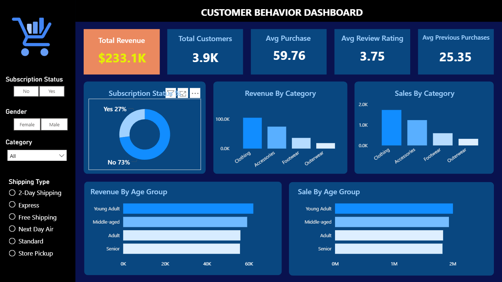

# 🛒 Customer Shopping Behavior Analysis  
### End-to-End Data Analytics Pipeline

---

## 📌 Project Overview

A leading retail company aims to better understand **customer shopping behavior** to improve sales performance, customer satisfaction, and long-term loyalty.

This project analyzes **3,900 transactional records** to uncover:
- Spending patterns  
- Customer segments  
- Product and shipping performance  

The solution follows a **full end-to-end data analytics workflow**, from raw data preparation to executive-level dashboards.

---

## 🔄 Project Workflow

The project was executed using a structured **7-step Data Analyst roadmap**:

> 📌 *Note: Upload the workflow image to the repository and name it `workflow_diagram.png`.*

### Workflow Steps
1. **Business Problem Definition** – Identify key business objectives  
2. **Data Modeling & EDA (Python)** – Data cleaning and transformation  
3. **Data Analysis (SQL)** – Complex analytical queries  
4. **Data Visualization (Power BI)** – Interactive dashboards  
5. **Project Report** – Insights and metrics summary  
6. **Presentation** – Business storytelling using Gamma AI  
7. **GitHub Documentation** – End-to-end project transparency  

---

## 🛠️ Phase 1: Data Preparation & EDA (Python)

Using **Pandas**, the raw dataset was cleaned and enhanced to ensure high data quality.

### Key Tasks
- **Missing Data Handling**  
  - Imputed **37 missing values** in `review_rating` using the **median rating per product category**

- **Standardization**  
  - Renamed columns to `snake_case` for readability and database compatibility

- **Feature Engineering**
  - Created `age_group`:
    - Young Adult  
    - Adult  
    - Middle-aged  
    - Senior  
  - Generated `purchase_frequency_days` for time-based analysis

- **Data Integration**
  - Cleaned dataset was loaded into **PostgreSQL** using **SQLAlchemy**

---

## 🔍 Phase 2: SQL Analysis – Business Insights

Advanced SQL queries were executed in **PostgreSQL** to answer key business questions.

### Key Findings
- **Revenue by Gender**
  - Male customers generated **$157,890**
  - Female customers generated **$75,191**

- **Customer Segmentation**
  - Loyal: **79.9%**
  - Returning: **17.9%**
  - New: **2.13%**

- **High-Value Customers**
  - Identified **839 customers** who used discounts but still spent **above average**

- **Shipping Strategy**
  - Express Shipping: **$60.48** average spend  
  - Standard Shipping: **$58.46** average spend  

---

## 📊 Phase 3: Power BI – Interactive Dashboard

The Power BI dashboard provides a **360° view of business performance**, with filters for:

- Subscription Status  
- Gender  
- Product Category  
- Shipping Type  

> 📌 *Note: Upload the dashboard screenshot and name it `dashboard_screenshot.png`.*

### Key Performance Indicators (KPIs)

| Metric | Value |
|------|------|
| **Total Revenue** | $233.1K |
| **Total Customers** | 3.9K |
| **Average Purchase Value** | $59.76 |
| **Average Review Rating** | 3.75 |
| **Avg Previous Purchases** | 25.35 |

---

## 💡 Strategic Recommendations

Based on the insights, the following strategies were proposed:

- **Boost Subscriptions**  
  - Target the **73% non-subscribers** with exclusive offers

- **Loyalty Progression**  
  - Introduce rewards to convert *Returning* customers into *Loyal* customers

- **Optimize Discount Policy**  
  - Protect margins on low-margin products (e.g., Hats, Sneakers)

- **Targeted Marketing Campaigns**  
  - Focus on the **Young Adult** segmen
